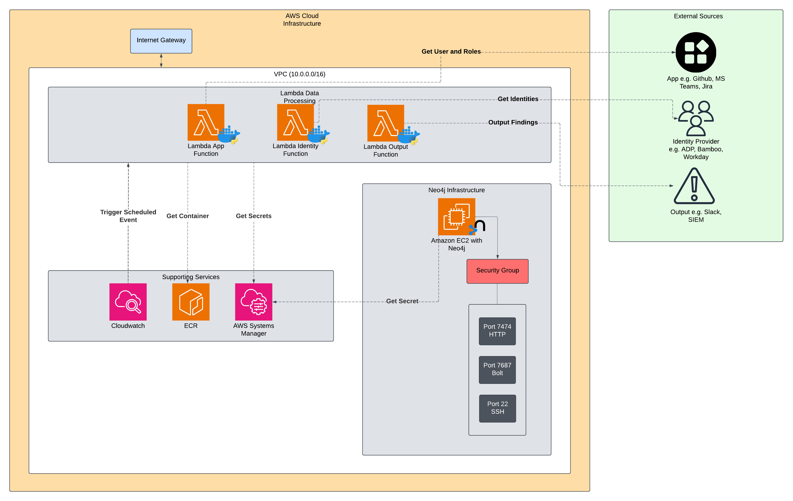
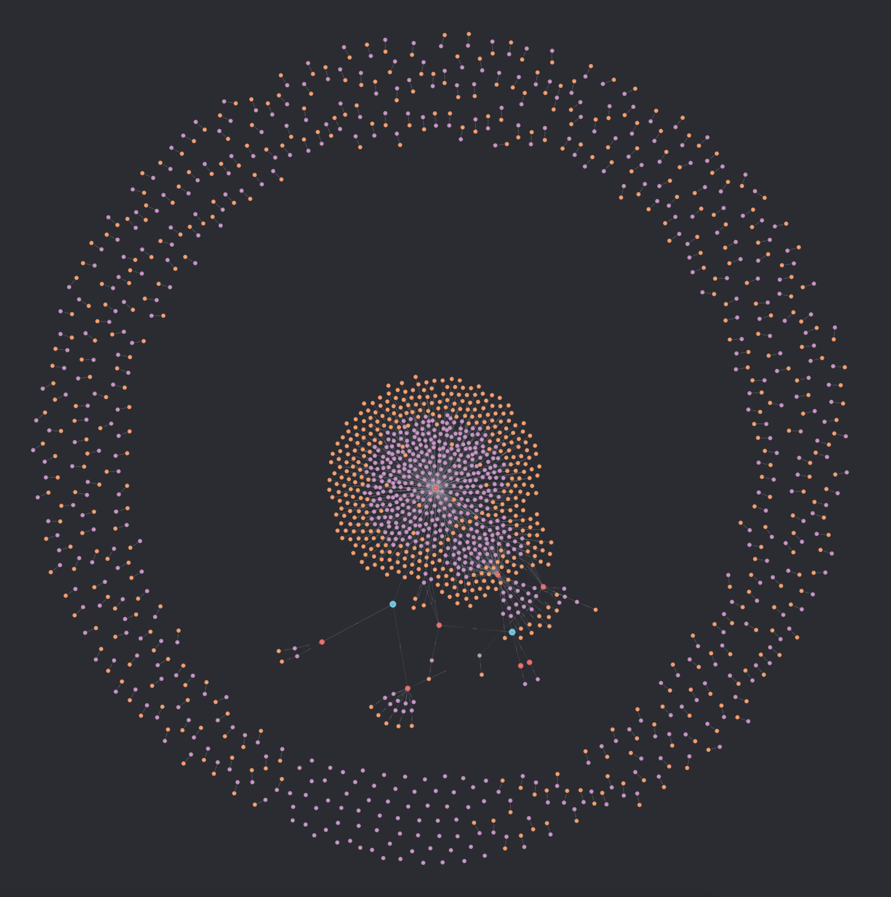
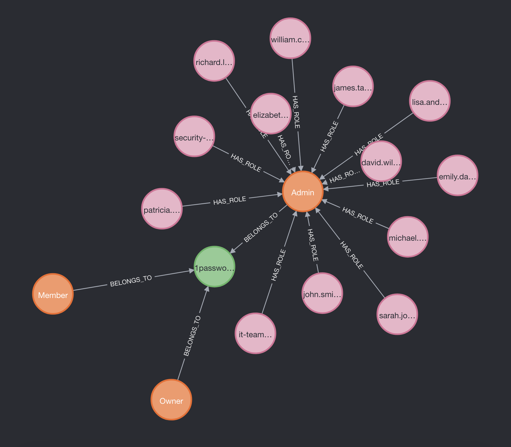
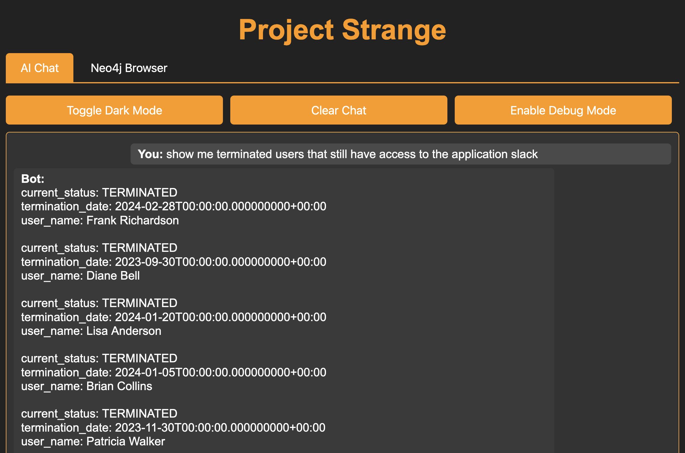

# Project Strange 🔍

Project Strange is an open-source IAM visibility tool that helps you tackle the complex world of access management. The idea came around after a number of challenges the Bugcrowd team was facing in managing distributed permissions and users across multiple systems. Project Strange provides a unified view of who has access to what and at what level, making identity management accessible and actionable for organisations of all sizes. The intent is to remove the classic roadblocks faced when maintaining IAM within any organisation, using automation and a single source of truth. 

## 🌟 Why Project Strange?

Services are becoming increasingly opaque and complex, especially around the management of various identities. Project Strange  addresses critical challenges in identity management:

- **Scattered Permissions**: Access rights spread across multiple platforms and services
- **Limited Visibility**: Difficulty in understanding who has access to what
- **Manual Reviews**: Time-consuming access audits and security reviews
- **Incident Response**: Slow reaction time when access needs to be reviewed or revoked
- **Complex Queries**: Need for specialised knowledge to understand access patterns

## 🎯 Key Features

- Comprehensive view of user access across all integrated systems
- Access mapping and visualisation
- Service account and bot management and monitoring
- External user access tracking
- Identify anomalies
- Attack surface management and analysis
- Natural language queries for accessing information
    - No query language knowledge required

## Architecture

### Infrastructure

Project Strange is a distributed system designed to map and monitor identity and access relationships across an organisation's technology stack. The architecture consists of three core components working together to build a comprehensive identity graph:

## Core Components

### 1. Identity Provider Connectors

Integrate with authoritative sources of identity data (e.g., ADP, BambooHR, Workday). These connectors pull user information including email, name, department, role, and other user attributes that establish the foundation of a user's identity within the organisation.

### 2. Application Connectors

Connect to various applications and services (e.g., GitHub, MS Teams, Jira) to extract user accounts and their associated roles/permissions. Each application connector maps its users back to the core identities established by the Identity Providers, creating a complete graph of user access across the organisation.

### 3. Output Connectors

Process the collected data to generate actionable insights (e.g., sending alerts to Slack or SIEM). For example, an output connector might identify terminated employees who still have active application access and trigger appropriate notifications.

## Technical Implementation

The system uses a modular adapter pattern where each connector (Identity, Application, or Output) implements a standardised interface while maintaining its specific integration logic. Each connector runs as an independent service with:

- A dedicated Lambda function running a Docker container (stored in ECR)
- Scheduled execution via CloudWatch Events
- Standardised data processing using an SDK to share code between each connector
- Data storage in a centralised Neo4j graph database

This architecture allows for:

- Easy addition of new connectors through consistent interfaces
- Isolated execution environments for each integration
- Scalable and maintainable identity mapping
- Real-time monitoring and alerting of access patterns

The resulting graph database provides a comprehensive view of who has access to what across the organisation, enabling security analysis, access reviews, and automated compliance monitoring.

All of this implementation is written in Terraform, with easy-to-deploy task files. 

## Gallery

### Visual Component

### AI Chatbot

## 📜 License

Project Strange is released under AGPLv3

## Appendix

### Glossary

**Identity:** Authoritative source of user information in an organisation. Provides core user attributes such as email, name, department, and employment status.

*Examples: ADP, BambooHR, Workday*

**App:** Systems that users access within an organisation. Contains their own user accounts and permission models that need to be mapped back to core identities.

*Examples: GitHub, Microsoft Teams, Jira*

**Output:** Destinations where Project Strange sends findings and alerts based on its analysis of identity and access data.

*Examples: Slack channels, SIEM systems*